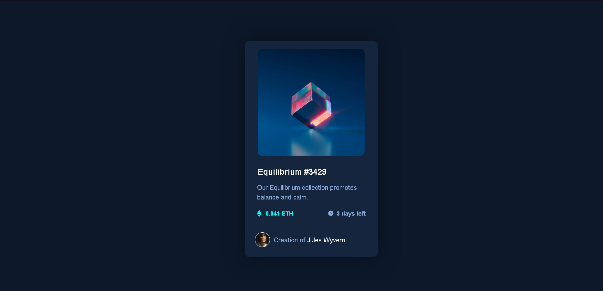

# Frontend Mentor - NFT preview card component solution

This is a solution to the [NFT preview card component challenge on Frontend Mentor](https://www.frontendmentor.io/challenges/nft-preview-card-component-SbdUL_w0U). Frontend Mentor challenges help you improve your coding skills by building realistic projects. 

## Table of contents

- [Overview](#overview)
  - [The challenge](#the-challenge)
  - [Screenshot](#screenshot)
  - [Links](#links)
- [My process](#my-process)
  - [Built with](#built-with)
  - [What I learned](#what-i-learned)
  - [Continued development](#continued-development)
  - [Useful resources](#useful-resources)

## Overview

### The challenge

Reconstruct the design of a NFT CARD, a Frontend Mentor beginner project.

### Screenshot



### Links

- Live Site URL: [https://izuca.github.io/Nft_Card/](https://izuca.github.io/Nft_Card/)
- Frontend Mentor project: [https://www.frontendmentor.io/challenges/nft-preview-card-component-SbdUL_w0U](https://www.frontendmentor.io/challenges/nft-preview-card-component-SbdUL_w0U)

## My process

### Built with

- HTML 5
- CSS 3
- Flexbox


### What I learned

- An introduction on how to use flexbox:

```css
.container {
  display:flex;
}
```
- Alt in HTML is an alternative way to name elements:

```html

```

- Looks like it's better to separate elements through divs so flexbox can work properly:

```html
<div class="info">
            <div class="cripto">
                <div>
                    
                </div>
                <div>
                    <h1 class="value">0.041 ETH</h1>
                </div>
            </div>
```

- How to make transitions in css:
```css
.item-title {
    margin: 0px 95px 0px 0px;
    transition-duration: 0.25s;
}

.item-title:hover{
    color:hsl(178, 100%, 50%);
}
```

- How to create a horizontal line in html:
```html
<hr class="line">
```

- How to use live server

- And how to use GitHub Pages

### Continued development

After concluding this project, I noticed that I could use easier ways to organize the elements in HTML. I should use CSS Custom Properties and a Mobile-first workflow, so the site works in every device. After posting this project, I'll be going to watch the project's solution on youtube in order to see which parts I can do better in the next project.

### Useful resources

- [W3Schools](https://www.w3schools.com/default.asp)
- [MDN Web Docs](https://developer.mozilla.org/pt-BR/)

